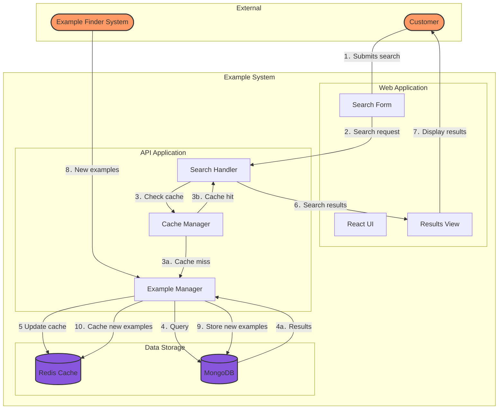

# Example data flow

This shows an entirely made up and probably nonsensical data flow.

```mermaid
flowchart TD
    subgraph External
        Customer([Customer])
        ExampleFinder([Example Finder System])
    end

    subgraph ExampleSystem[Example System]
        subgraph WebApp[Web Application]
            UI[React UI]
            SearchForm[Search Form]
            ResultsView[Results View]
        end

        subgraph API[API Application]
            SearchHandler[Search Handler]
            ExampleManager[Example Manager]
            CacheManager[Cache Manager]
        end

        subgraph Storage[Data Storage]
            Redis[(Redis Cache)]
            MongoDB[(MongoDB)]
        end
    end

    %% External Data Flows
    Customer ---|"1․ Submits search"| SearchForm
    ExampleFinder -->|"8․ New examples"| ExampleManager

    %% Web App Flows
    SearchForm -->|"2․ Search request"| SearchHandler
    SearchHandler -->|"6․ Search results"| ResultsView
    ResultsView -->|"7․ Display results"| Customer

    %% API Flows
    SearchHandler -->|"3․ Check cache"| CacheManager
    CacheManager -->|"3a․ Cache miss"| ExampleManager
    CacheManager -->|"3b․ Cache hit"| SearchHandler
    ExampleManager -->|"4․ Query"| MongoDB
    MongoDB -->|"4a․ Results"| ExampleManager
    ExampleManager -->|"5 Update cache"| Redis

    %% Data Storage Flows
    ExampleManager -->|"9․ Store new examples"| MongoDB
    ExampleManager -->|"10․ Cache new examples"| Redis

    classDef external fill:#f96,stroke:#333,stroke-width:2px
    classDef storage fill:#85d,stroke:#333,stroke-width:2px
    class Customer,ExampleFinder external
    class Redis,MongoDB storage
```
