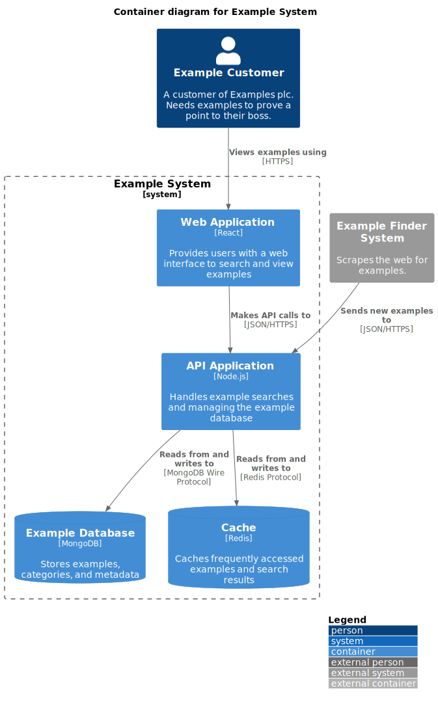

# Example system

A system to store and help users find examples for any purpose

## Context diagram

## Container diagram

## Capabilities

### Store and serve examples

Provides REST endpoints to validate, store and serve examples.
