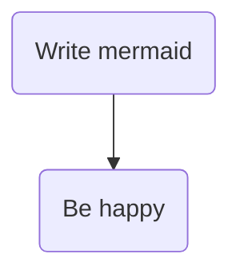

# Docs as code

This template repo can be used to author your technical documentation and slide decks in markdown, mermaid and/or PlantUML. Using the npm scripts you can generate diagrams as svg/png etc, output slide decks in html/pptx and push everything to confluence.

The repo uses and is entirely dependent on:

- [Mermaid](https://mermaid.js.org/)
- [PlantUML](https://plantuml.com/)
- [Marp](https://marp.app/)
- [Markdown Confluence](https://github.com/markdown-confluence/markdown-confluence)

## Generate diagrams

To generate the PlantUML diagrams via docker, run:

```bash
npm run start
npm run generate
```

if using podman run:

```bash
npm run start-pod
npm run generate
```

This will start a container that is able to render the puml files into svg pictures.

> note: the puml files must all be under the `./docs` folder.

If you would like a live puml preview and use vscode, try the extension `jebbs.plantuml` with the following settings:

```json
  "plantuml.server": "http://localhost:8088",
  "plantuml.render": "PlantUMLServer",
  "plantuml.exportOutDir": "docs",
  "plantuml.exportFormat": "svg",
  "plantuml.diagramsRoot": "docs",
  "plantuml.exportSubFolder": false,
  "plantuml.exportIncludeFolderHeirarchy": true,
```

## Diagrams

Diagrams can be written in [mermaid](https://mermaid.js.org/), [PlantUML](https://plantuml.com/) or [GraphViz](https://graphviz.org/).

Mermaid is the simplest and can be added directly to markdown files like so:



PlantUML offers more diagram types and better rendering of C4 architecture diagrams. To create these,
add a `.puml` file anywhere under the `./docs` folder and follow the instructions above to generate.
For a better authoring experience, install the [PlantUML VSCode extension](https://marketplace.visualstudio.com/items?itemName=jebbs.plantuml) and [syntax extension](https://marketplace.visualstudio.com/items?itemName=qhoekman.language-plantuml).

The vscode workspace settings to render live previews with the local PlantUML server (npm run start) are included in this repo.

## Slide decks

If you need to produce slide decks, you can
produce these using markdown with the excellent [marp](https://marp.app/). Again, there is a [VSCode extension](https://marketplace.visualstudio.com/items?itemName=marp-team.marp-vscode) to provide live previews.

To create a powerpoint deck for your markdown slide deck, add an npm script for your file, similar
to `generate:intro`.

## Publish to confluence

The contents of the `docs` folder can be pushed to confluence by running `npm run publish`.

They will be published under this parent page: https://eaflood.atlassian.net/wiki/spaces/FFG/pages/5411209331/Future+Farming+Grants+Technical+Documentation

You will need to specify a username and API key in a .env file. To do so, create an API token
[here](https://id.atlassian.com/manage-profile/security/api-tokens) then copy the .env.example file to a file called .env then fill out your atlassian username and API token.
